# これは何

イクシエの連絡帳を一度にまとめてエクスポートするツールです。

# 使い方

## Windows

Windowsの場合、Windowsセキュリティがixsie-exporterをトロイの木馬として認識してしまうため、これを解除する必要があります。下のステップ2からステップ8までが解除操作に当たります。

1. [Windows用実行ファイル（zipファイル）](https://github.com/maoe/ixsie-exporter/releases/download/v0.1.0/ixsie-exporter-x86_64-pc-windows-msvc.zip)をダウンロード
2. Windowsセキュリティの警告のポップアップをクリック。もし表示されなければステップ9へ。
  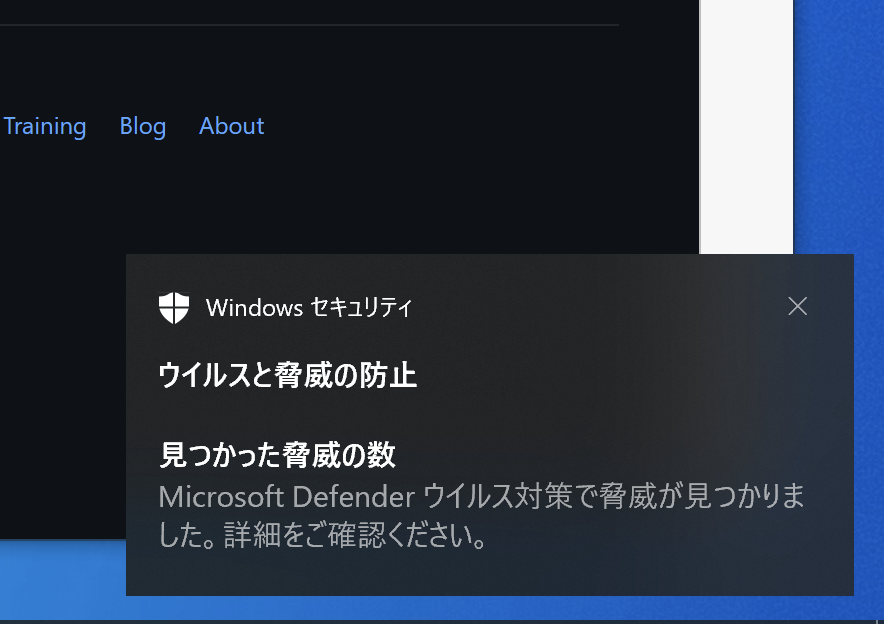
3. Windowsセキュリティに表示されている脅威のうち 「Trojan Script/Wacatac.H!ml」 をクリック
  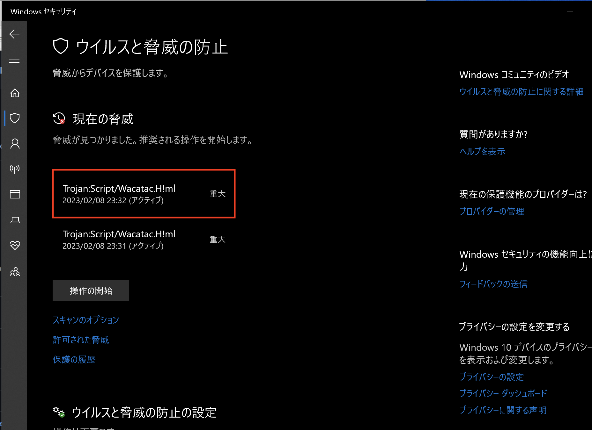
4. 「詳細を表示」をクリック
  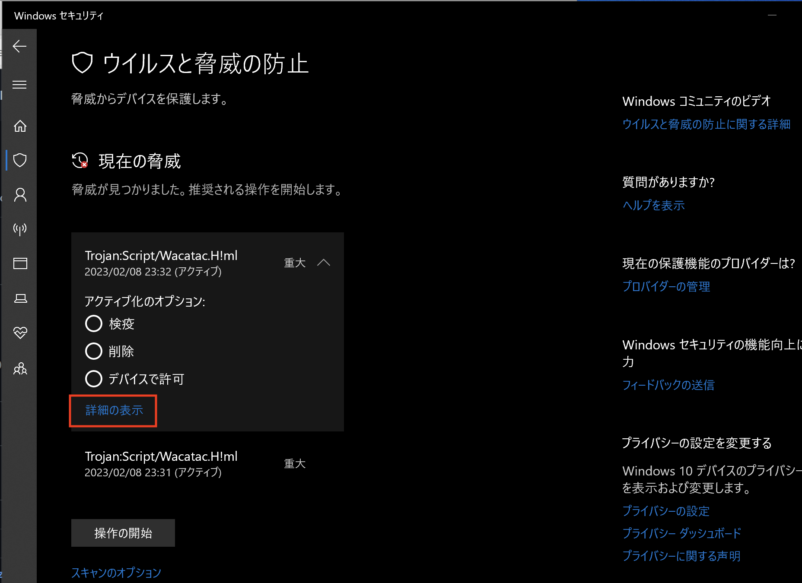
5. 「このアプリがデバイスに変更を加えることを許可しますか？」の質問に「はい」と答える
  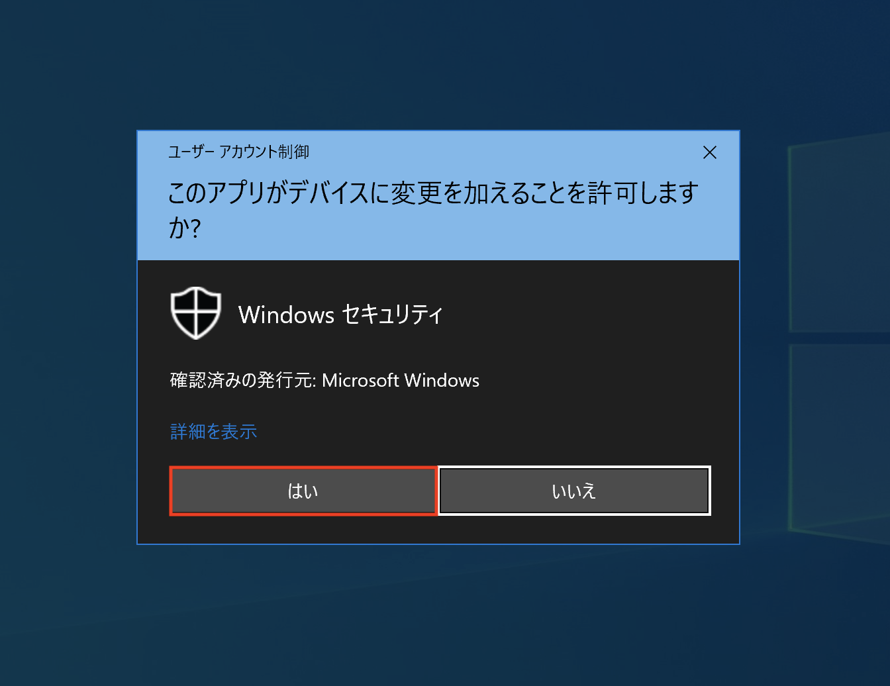
6. 「影響を受けた項目」 に「ixsie-exporter」の文字列が含まれていることを確認して「OK」する
  
7. 「デバイスで許可」を選択して「操作の開始」を押す
  
8. 再度「このアプリがデバイスに変更を加えることを許可しますか？」 に「はい」と答える
  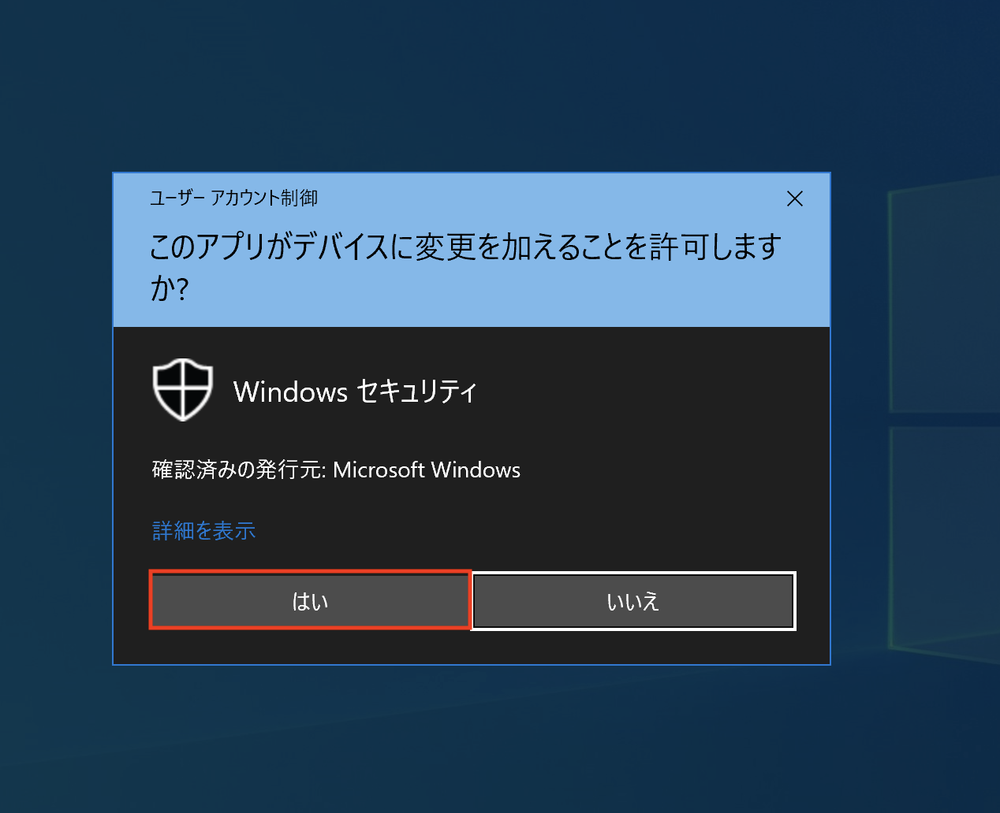
9. ブラウザのダウンロード一覧から「ixsie-exporter-x86_64-pc-windows-msvc.zip」をクリックする
  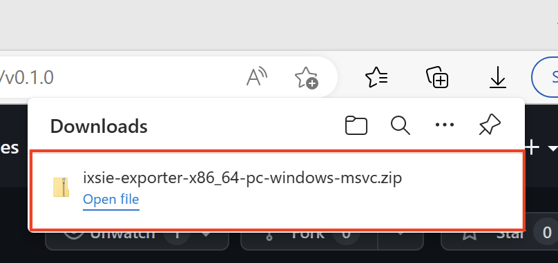
10. エクスプローラー上部ピンク色の「展開」を選択し、「すべて展開」を押す。
  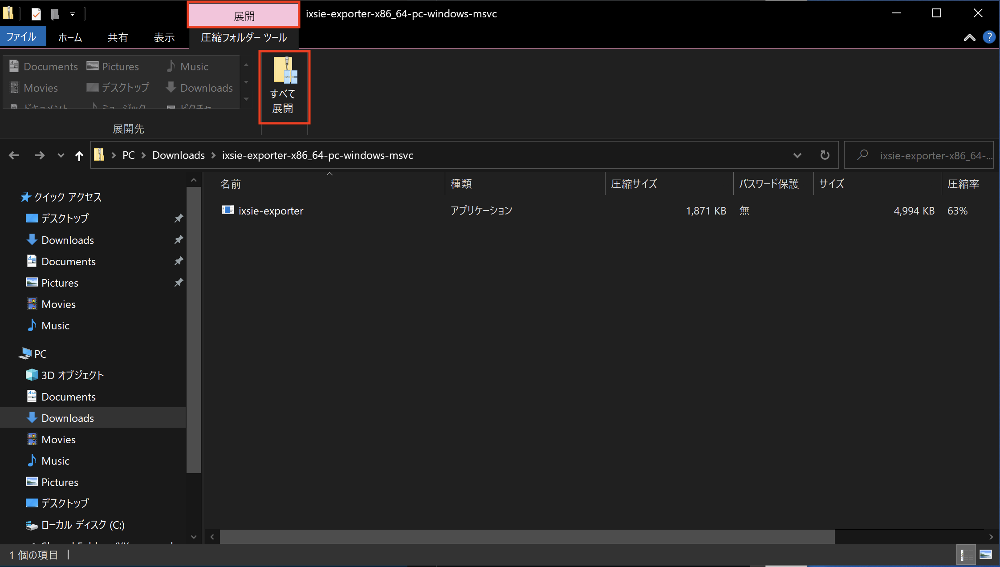
11. 「完了時に展開されたファイルを表示する」にチェックを入れて「展開」する。新しく開いたエクスプローラーに「ixsie-expoter」が表示される。
  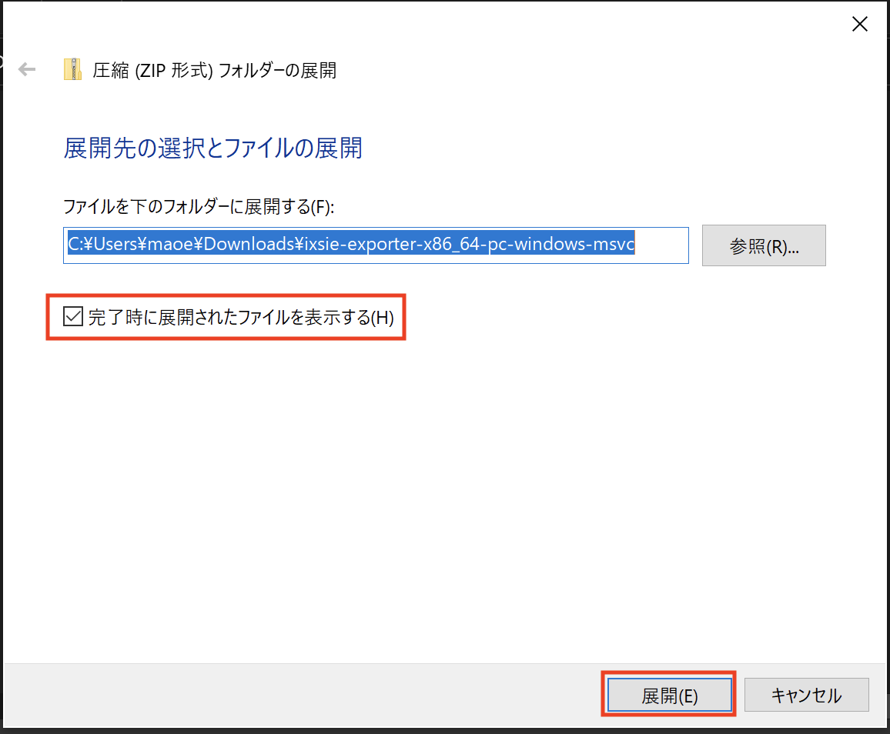
12. Windowsのスタートメニューに「cmd」と入力してコマンドプロンプトを起動する
  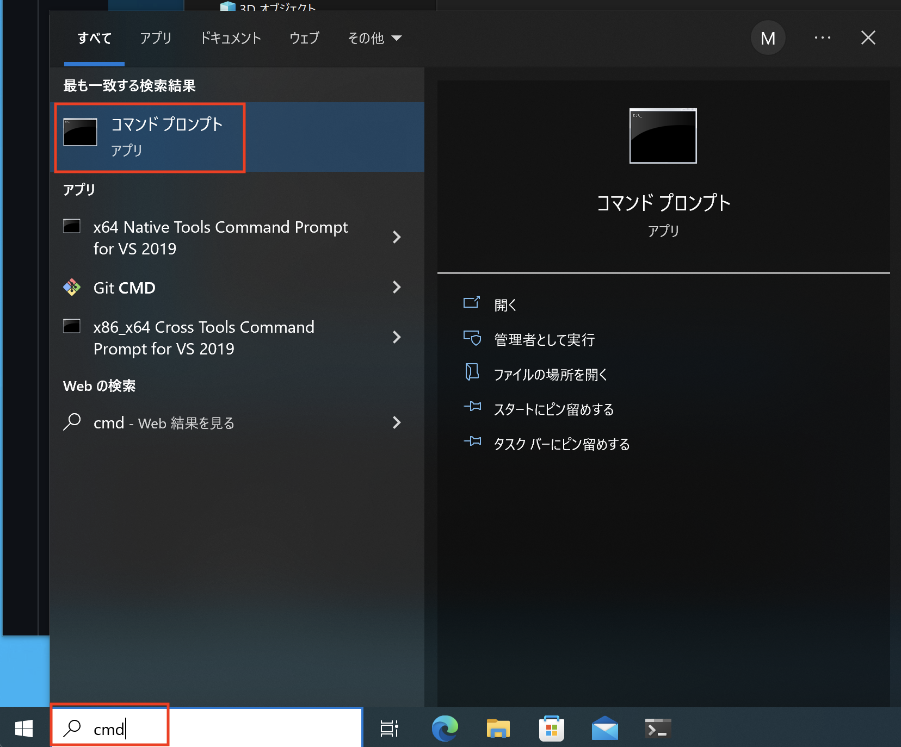
13. コマンドプロンプトに「cd Desktop」と入力してエンターを押す
  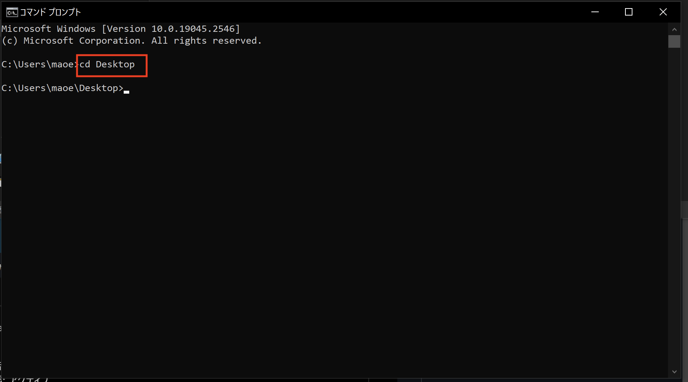
14. 先ほど展開した「ixsie-exporter」をコマンドプロンプトにドラッグアンドドロップして、エンターを押す。
  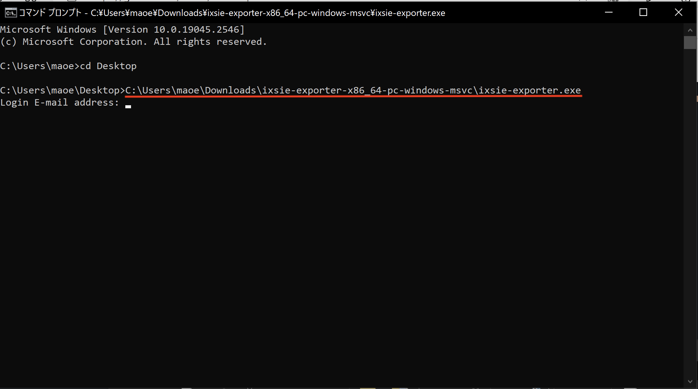
15. 「Login E-mail address:」と表示される。イクシエのログインメールアドレスを入力してエンターを押す。
  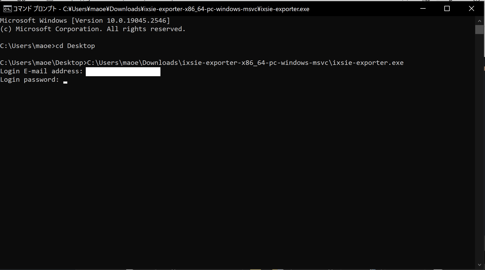
16. 「Login password:」と表示される。イクシエのログインパスワードを入力してエンターを押す。ログインに成功するとダウンロードが始まる。コマンドプロンプトにはダウンロードが終わった順に「年-月」が表示される。
  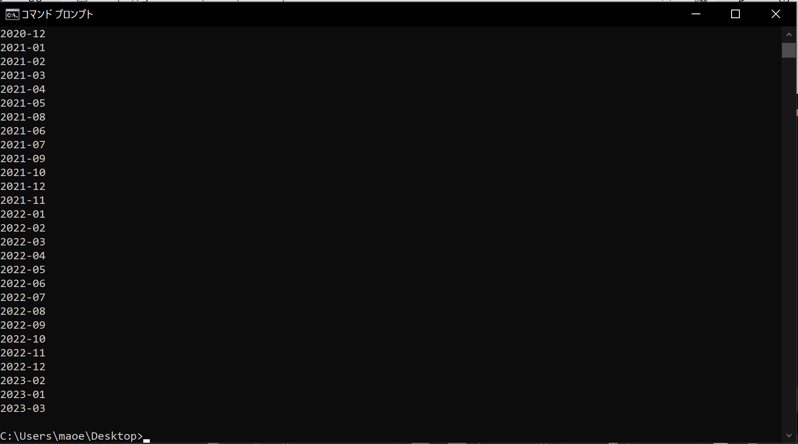
17. すべて終わったら「Windowsセキュリティ」を開き「ウイルスの脅威と防止」をクリックして、「許可された脅威」をクリック。先ほど許可した「Trojan:Script/Wacatac.H!ml」を選択して「許可しない」を押す。

以上で終了です。ダウンロードしたPDFはデスクトップにあります。

## macOS
