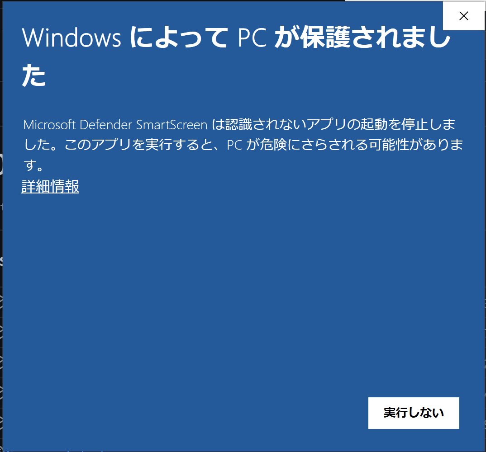
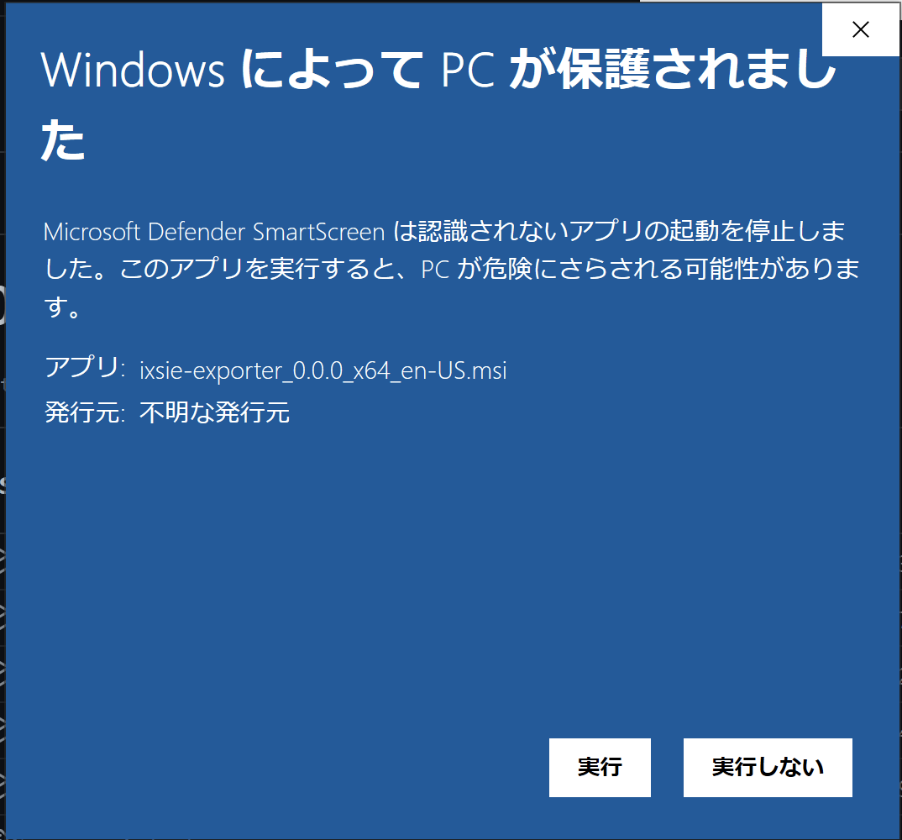
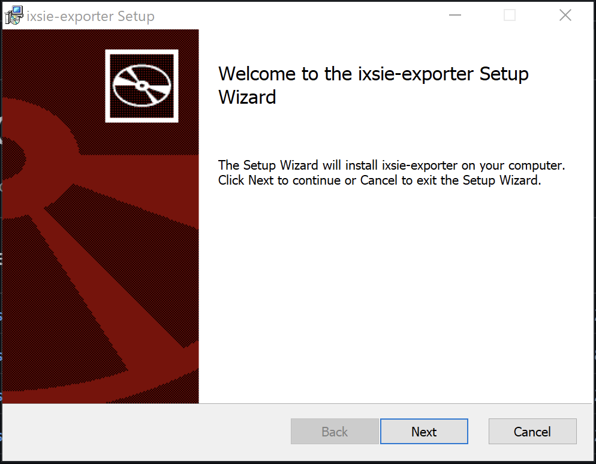
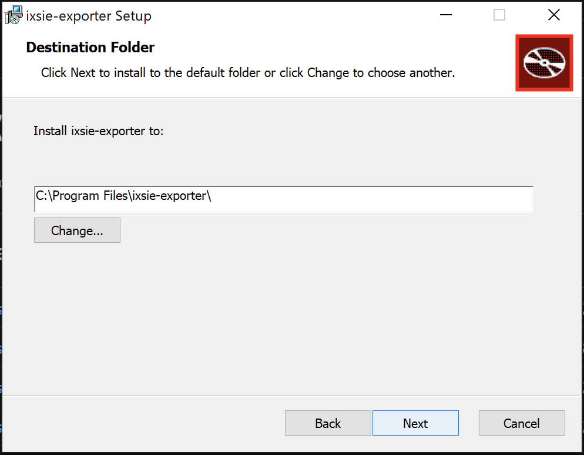
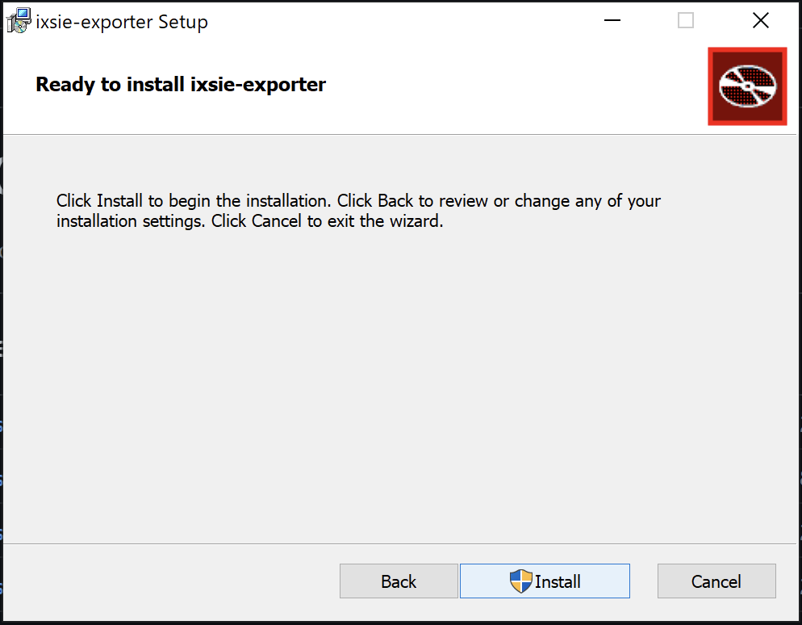
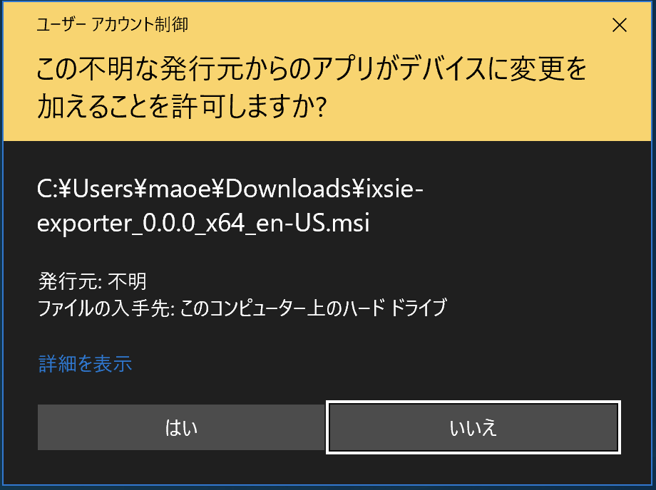
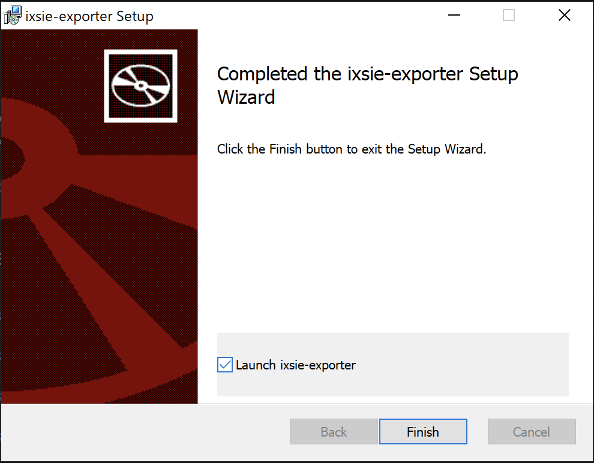

# ixsie-exporter

このツールはイクシエの連絡帳を一括ダウンロードするものです。イクシエの利用者が利便性向上のため勝手に作ったもので、公式サイトや運営会社とは一切関係がありません。また、使い方やインストールに関するサポートはありません。自己責任で使用してください。

## このツールの安全性について

このツールはイクシエにログインするために、ログインメールアドレスとパスワードを入力する必要があります。入力した情報はイクシエにログインするためだけに使われ、イクシエ以外のドメインには送信されません。

このツールのソースコードは[GitHub](https://github.com/maoe/ixsie-exporter)で確認できます。インストーラやアプリ自体はソースコードから[GitHub Actions](https://github.com/maoe/ixsie-exporter/actions)で自動的に生成されています。

## 使い方

### Windows

1. [インストーラ](https://github.com/maoe/ixsie-exporter/releases/download/untagged-666b666aafefabf46765/ixsie-exporter_0.0.0_x64_en-US.msi)をダウンロードする。
2. インストーラを実行する。「WindowsによってPCが保護されました」と出た場合は「詳細情報」をクリックする。
    
3. 「実行」をクリックする。
    
4. インストーラの「Next」をクリックする。
    
5. Destination Folderも「Next」をクリックする。
    
6. Ready to install ixsie-exporterで「Install」をクリックする。
    
7. 「ユーザーアカウント制御」のダイアログがでたら「はい」をクリックする。
    
8. インストール完了時に「Launch ixsie-exporter」にチェックを入れて「Finish」をクリックする。
    
9. ixsie-exporterが起動する。ログイン情報と入力し、期間・保存先を必要に応じて変更して、「ダウンロードする」をクリックする。
10. プログレスバーが右端まで行けば完了。

### macOS

### Linux