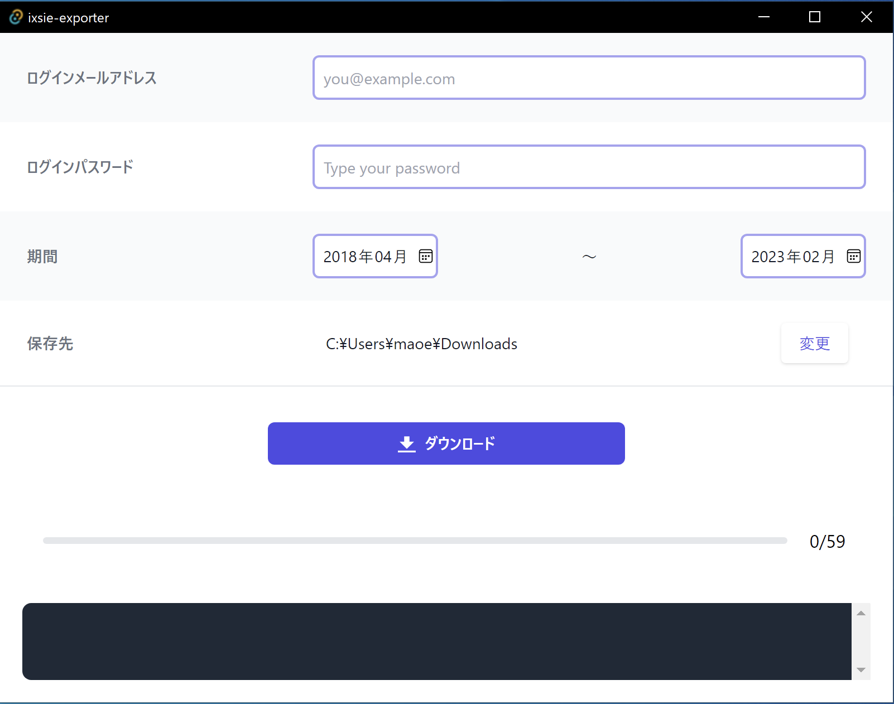
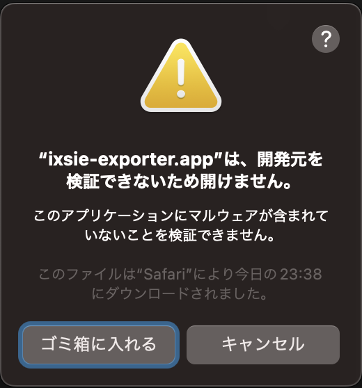
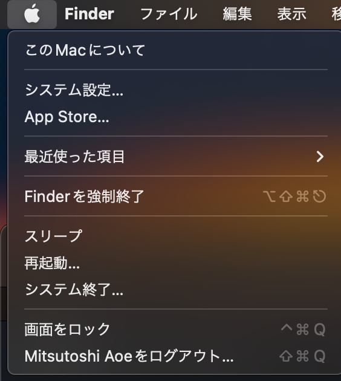
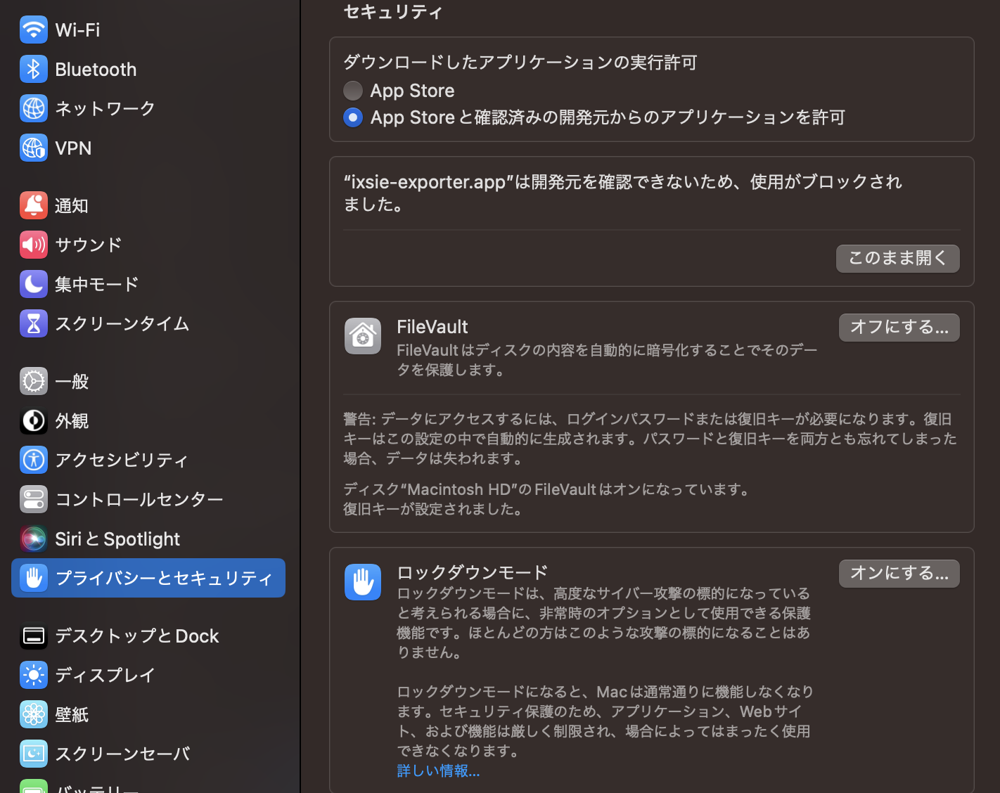
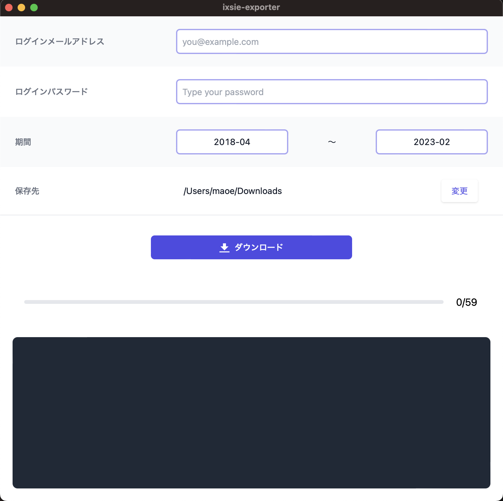

# ixsie-exporter

このツールはイクシエの連絡帳を一括ダウンロードするものです。イクシエの利用者が利便性向上のため勝手に作ったもので、公式サイトや運営会社とは一切関係がありません。また、使い方やインストールに関するサポートはありません。自己責任で使用してください。

## このツールの安全性について

このツールはイクシエにログインするために、ログインメールアドレスとパスワードを入力する必要があります。入力した情報はイクシエにログインするためだけに使われ、イクシエ以外のドメインには送信されません。

このツールのソースコードは[GitHub](https://github.com/maoe/ixsie-exporter)で確認できます。インストーラやアプリ自体はソースコードから[GitHub Actions](https://github.com/maoe/ixsie-exporter/actions)で自動的に生成されています。

## 使い方

### Windows

1. [インストーラ](https://github.com/maoe/ixsie-exporter/releases/download/v0.0.0/ixsie-exporter_0.0.0_x64_en-US.msi)をダウンロードする。
2. インストーラを実行する。「WindowsによってPCが保護されました」と出た場合は「詳細情報」をクリックする。
    
3. 「実行」をクリックする。
    
4. インストーラの「Next」をクリックする。
    
5. Destination Folderも変更が必要なければ「Next」をクリックする。
    
6. Ready to install ixsie-exporterで「Install」をクリックする。
    
7. 「ユーザーアカウント制御」のダイアログがでたら「はい」をクリックする。
    
8. インストール完了時に「Launch ixsie-exporter」にチェックを入れて「Finish」をクリックする。
    
9. ixsie-exporterが起動する。ログイン情報を入力し、期間・保存先を必要に応じて変更して、「ダウンロードする」をクリックする。
    
10. プログレスバーが右端まで行けば完了。

### macOS

1. [アプリケーション](https://github.com/maoe/ixsie-exporter/releases/download/v0.0.0/ixsie-exporter.app.tar.gz)をダウンロードする。
2. ダウンロードした`ixsie-exporter.app.tar`をクリックして展開する。
3. 展開した`ixsie-exporter.app`をクリックして起動する。
4. 「"ixsie-exporter.app"は、開発元を検証できないため開けません。」の警告はキャンセルする。
    
5. メニューから「システム設定」を選択する。
    
6. 「プライバシーとセキュリティ」から「このまま開く」をクリックする。
    
7. 「"ixsie-exporter.app"の開発元を検証できません。開いてもよろしいですか？」に「開く」と答える。
    
8. 9. ixsie-exporterが起動する。ログイン情報を入力し、期間・保存先を必要に応じて変更して、「ダウンロードする」をクリックする。
    
10. プログレスバーが右端まで行けば完了。
